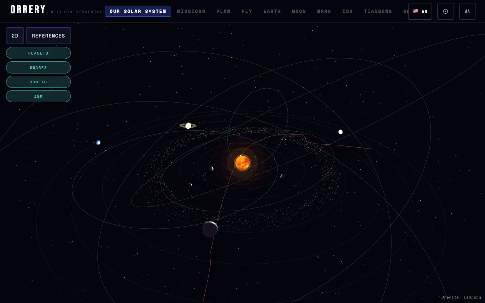

# Orrery

The orbital mechanics tools NASA uses to reach Mars, rebuilt for anyone who's curious. Real physics, real missions from Sputnik to Artemis II, in **13 languages**. Beautiful, educational, self-hostable.

[](https://github.com/chipi/orrery/actions/workflows/ci.yml)
[](https://github.com/chipi/orrery/actions/workflows/e2e.yml)
[](https://chipi.github.io/orrery/)
[](https://github.com/chipi/orrery/releases)
[](LICENSE)
[](https://kit.svelte.dev/)
[](tsconfig.json)
[](docs/adr/ADR-029.md)
[](#privacy)
[](docs/i18n-style-guide.md)



## What it is

A browser-based **solar system explorer**, **mission simulator**, **encyclopedia**, and **station explorer** rolled into one. It uses the same orbital mechanics behind real mission planning — Keplerian orbits, Lambert solvers, porkchop plots, vis-viva, Tsiolkovsky — and presents them in a way that a curious person can understand by doing.

The name comes from a mechanical model of the solar system. That is exactly what Orrery does, at the scale of a screen.

**No backend. No database. No tracking.** A static SPA you can self-host, install as a PWA, and use offline after first load.

## Live

**<https://chipi.github.io/orrery/>** — every screen, fully offline-capable after first load.

Available in **13 languages, all at 100% UI parity**: English · Español · Français · Deutsch · Português (BR) · Italiano · 中文 · 日本語 · 한국어 · हिन्दी · العربية (RTL) · Русский · Српски (Cyrillic).

## Ten screens

The full nav (left to right): `/explore` · `/plan` · `/fly` · `/missions` · `/earth` · `/moon` · `/mars` · `/iss` · `/tiangong` · `/science`.

| Screen | What it shows |
|---|---|
| **Solar System Explorer** (`/explore`) | Real-time 3D / 2D orrery — 8 planets + 5 dwarf planets + 2 comets + ʻOumuamua, with togglable visibility layers and clickable bodies. Detail panels: OVERVIEW · GALLERY · TECHNICAL · SCIENCE. Live physics overlays behind the Science Lens (gravity, velocity, centripetal, apsides + true anomaly, sphere-of-influence rings, hover info cards). |
| **Mission Configurator** (`/plan`) | 11,200-cell Lambert porkchop plot per destination — Earth → 9 destinations (Mercury · Venus · Mars · Jupiter · Saturn · Uranus · Neptune · Pluto · Ceres) with LANDING / FLYBY toggle. **Mission Sandbox**: pin one cell, click another → ΔDEP / ΔTOF / Δ∆v compare. 13 rockets to choose from, real ∆v budget. |
| **Mission Arc** (`/fly`) | Fly a mission — live telemetry, transfer arc as a true Keplerian two-point ellipse with Sun at focus, fuel model, timeline scrubber. **Flight Director banner** narrates 5 physics phases (Departure · Trans-X Injection · Cruise · Approach · Arrival), each phase deep-linking to the matching `/science` chapter. CAPCOM panel with mission events. **Conic-section side panel** detects ellipse / parabola / hyperbola live. |
| **Mission Catalog** (`/missions`) | **36** historical, planned, and concept missions across Mars + Moon + outer-system probes — every agency, every outcome, replayable. Timeline navigator (1957 → 2035) above the card grid. Per-mission flight params with caveat banners (RECONSTRUCTED / SPARSE / UNKNOWN). |
| **Earth Orbit** (`/earth`) | ISS, Tiangong, Hubble, JWST, Gaia, Chandra, XMM, LRO + the four GNSS constellations on a logarithmic scale. Real inclinations, real altitudes. Atmosphere shell layer (Kármán line, 100 km) and **ozone-hole layer** (polar depletion zones) lens-gated. |
| **Moon Map** (`/moon`) | 16 landing sites across 5 nations — Apollo through Chandrayaan-3, the capability ladder that made Mars possible. Tidal-lock indicator marks the Earth-facing hemisphere lens-gated. |
| **Mars Surface Map** (`/mars`) | Equirectangular 2D map + 3D globe — 16 surface sites (rovers, landers, sample-return) + 11 orbital probes. Rover traverse paths overlaid as cross-linked routes. Atmosphere shell layer (~120 km) lens-gated. |
| **ISS Explorer** (`/iss`) | The full station — **18 modules** (every USOS + ROS module + visitors) with raycast pickability, hover outlines, sun-tracking solar arrays, microgravity-axes overlay (zenith/nadir, prograde/retrograde, port/starboard). Per-module ANATOMY tabs with hand-drawn schematics. **9 visiting-spacecraft diagrams** (Crew Dragon, Cargo Dragon, Cygnus, Soyuz MS, Progress MS, HTV-X, Starliner, Shenzhou, Tianzhou). |
| **Tiangong Explorer** (`/tiangong`) | China's space station — Tianhe core + Wentian + Mengtian labs (4 module overlays) with sun-tracking gallium-arsenide arrays. 2D blueprint views (top + side). Same module-pickability + microgravity-frame overlays as `/iss`. |
| **Science Encyclopedia** (`/science`) | **54 sections across 8 tabs** — Orbits · Transfers · Propulsion · Mission Phases · Scales & Time · Porkchop · Space Stations · History (plus a Space-101 editorial landing page). KaTeX-rendered formulas. **62 hand-coded SVG diagrams** (54 sections + 8 tab covers). Cmd-K search. Cross-screen `?`-chips deep-link from any other screen straight to the relevant chapter. |

Plus two read-only pages: **`/credits`** (per-image provenance manifest + text-source attributions) and **`/library`** (bill-of-links across the entire app — every outbound LEARN link with native-language priority and freshness gating).

| Explorer | Configurator | Mission Arc |
|---|---|---|
|  |  |  |
| **Catalog** | **Earth Orbit** | **Moon Map** |
|  |  |  |

## The Science Lens — turning the simulator into a textbook

Toggle the lens (top-nav icon) and every 3D scene gets a layer of live physics annotations:

- **Spheres of influence** — translucent rings showing where each body's gravity dominates.
- **Hover info cards** — live numbers (heliocentric speed, distance, gravity, light-time) on any planet.
- **Gravity vectors · Velocity vectors · Centripetal arrows** — log-scaled arrows so all are visible at once, with values printed at the tip so you can compare magnitudes across planets.
- **Apsides + true anomaly** — perihelion / aphelion markers + a live `ν = 42°` callout that travels with the body.
- **Engine-off coast preview** — dotted projection of where the spacecraft would drift if the engine cut right now.
- **Conic-section family** — names the current arc shape (circle / ellipse / parabola / hyperbola) live from specific orbital energy.
- **Microgravity axes** — zenith/nadir, prograde/retrograde, port/starboard on station scenes.
- **Atmosphere shells**, **tidal-lock indicator**, **ozone holes** — lens-gated atmospheric and rotational layers.

The **Flight Director banner** on `/fly` adds 5-phase narration (Departure · Trans-X Injection · Cruise · Approach · Arrival), each phase deep-linking to the corresponding `/science` section. **Why? popovers** explain individual numeric labels in context across every panel, and the **Mission Sandbox** layered onto the porkchop lets you pin one cell and click another to compare ΔDEP / ΔTOF / Δ∆v side-by-side.

Casual users see clean scenes. Curious users opt-in to the entire physics layer.

## Try a mission

The 36 missions in the catalog include flown classics, outer-system landmarks, recent flights, and a handful of concept missions:

| Pick | Why |
|---|---|
| `?mission=apollo11` | First crewed lunar landing — see the free-return trajectory in heliocentric frame |
| `?mission=artemis2` | The 2026 lunar flyby that inspired this project |
| `?mission=curiosity` | One-way Mars landing — watch the live Mars dot meet the spacecraft at arrival |
| `?mission=mariner4` | First Mars flyby (1964) — short transit, real launch window |
| `?mission=galileo` | Outer-system gravity assist via Venus + Earth + Earth en route to Jupiter |
| `?mission=inspiration-mars` | Tito's 2013 free-return Mars flyby concept (501 days) |
| `?mission=starship-mars-crew` | SpaceX's long-term crewed Mars round-trip architecture |
| `?mission=tianwen1` | China's first Mars mission |

## Why it matters

Orrery makes a few claims a screen reader can verify:

- **Real physics.** Keplerian two-body orbital mechanics. Lagrange-Gauss short-way Lambert solver. Vis-viva for heliocentric velocity. Tsiolkovsky for fuel. KaTeX-rendered formulas in the encyclopedia. All constants from IAU + JPL + agency mission reports — every number cited.
- **Real missions.** 36 base mission JSON files with editorial overlays in 13 locales. ∆v ledgers from NASA mission reports, JPL trajectory reconstructions, agency press kits. Every entry has a `data_quality` honesty flag (MEASURED / RECONSTRUCTED / SPARSE / UNKNOWN).
- **Real images.** Agency-first build-time imagery sourcing per [ADR-046](docs/adr/ADR-046.md): NASA / ESA / ISRO / CNSA / JAXA / KARI / Roscosmos before Wikimedia fallback. Per-image provenance manifest. Public [`/credits`](https://chipi.github.io/orrery/credits) page. Lightbox attribution on every gallery thumbnail.
- **Real outbound links.** Per-link provenance per [ADR-051](docs/adr/ADR-051.md): every external LEARN link is sourced, validated, and freshness-gated. Native-language priority for non-US entities (Roscosmos before NASA's mirror, ISRO before press releases). Public [`/library`](https://chipi.github.io/orrery/library) bill-of-links.
- **Real translation.** Each language follows its own space-agency glossary (ESA Spanish, JAXA Japanese, CNSA Mandarin, etc.) — not literal machine translation. See [`docs/i18n-style-guide.md`](docs/i18n-style-guide.md).

## Privacy

No analytics. No tracking. No third-party fonts at runtime (every asset resolved at build time per [ADR-016](docs/adr/ADR-016.md)). No cookies. No `localStorage`. Locale preference lives in the URL — bookmark `?lang=ja` and you have your locale; share it and they have theirs.

## Getting started

Requirements: Node 20+, npm 10+.

```bash
git clone https://github.com/chipi/orrery
cd orrery
npm install
```

### Development

```bash
npm run dev              # dev server at http://localhost:5273
npm run test             # Vitest unit tests
npm run test:e2e         # Playwright e2e (build runs first)
npm run typecheck        # svelte-check + i18n compile
npm run lint             # prettier + eslint
npm run validate-data    # ajv schema + image provenance + license allowlist + diagram integrity
npm run preflight        # full CI mirror: typecheck + lint + test + validate-data + build (run before pushing)
```

### Build

```bash
npm run build            # production SPA in ./build (adapter-static)
npm run preview          # serve ./build at http://localhost:5273
npm run docs:build       # VitePress docs site at docs/.vitepress/dist
```

### Deploy

Push to `main` — `.github/workflows/preview.yml` builds the app + docs and publishes to GitHub Pages. A weekly cron rebuild keeps mission imagery fresh (Mondays 06:00 UTC).

## Documentation

The full architecture and concept documentation is published at **<https://chipi.github.io/orrery/docs/>** — VitePress with local search and sidebar navigation.

| Document | Read it for |
|---|---|
| [User guide](docs/user-guide.md) | How each of the ten screens works — the read-this-first guide for the live app |
| [00 Introduction](docs/concept/00_Introduction.md) | What this package is and how to read it |
| [01 Vision](docs/concept/01_Orrery_Vision.md) | Why Orrery exists — the Moon-to-Mars narrative |
| [02 Project Concept](docs/concept/02_Project_Concept.md) | Full synthesis — what Orrery is, does, and means |
| [03 Data Catalog](docs/concept/03_Data_Catalog.md) | Every source, constant, mission schema, credit format |
| [05 Design System](docs/concept/05_Design_System.md) | Colour, typography, components, screen patterns |
| [i18n style guide](docs/i18n-style-guide.md) | Per-language glossary for translators |
| [`docs/adr/`](docs/adr/) | 50+ ADRs (ADR-001 through ADR-051) — locked decisions (Status / Decision / Rationale / Consequences) |
| [`docs/rfc/`](docs/rfc/) | RFCs for technical questions; closed RFCs become ADRs |
| [`docs/prd/`](docs/prd/) | Product requirements per screen (PRDs 008–011 cover the four routes added in v0.4–v0.5: /science · /mars · /iss · /tiangong) |
| [`docs/uxs/`](docs/uxs/) | UX specifications per screen |
| [`CLAUDE.md`](CLAUDE.md) | Engineering constraints + locked decisions for AI / human contributors |

**If you read one document:** read [02 Project Concept](docs/concept/02_Project_Concept.md). It is the complete synthesis.

**If you want to add a mission:** read [03 Data Catalog](docs/concept/03_Data_Catalog.md). Mission data is plain JSON.

**If you want to translate Orrery:** read [the i18n style guide](docs/i18n-style-guide.md) and follow any locale's overlay tree under `static/data/i18n/<code>/` as a template.

## Physics

- Keplerian orbital mechanics, J2000 epoch (correct enough to teach, fast enough for a browser)
- Lambert solver: Lagrange-Gauss short-way formulation, 52 iterations, 11,200 cells
- Two-point Keplerian transfer ellipse with Sun at focus (`transferEllipse`) — both endpoints pin to live planet positions
- Vis-viva for heliocentric velocity telemetry
- Tsiolkovsky rocket equation for payload / fuel calculations
- Logarithmic radial scale for Earth orbit: `EARTH_VIS_R + LOG_K × log₁₀(1 + alt_km / 100)`
- Specific orbital energy ε for live conic-section classification on `/fly`

All constants documented in [03 Data Catalog](docs/concept/03_Data_Catalog.md) with IAU sources. The `/science` encyclopedia carries the same numbers and derivations with KaTeX-rendered proofs.

## Data

Mission data lives in plain JSON files — one per mission — served statically. No database, no backend. Adding a mission is editing a JSON file. Adding a language is adding a folder under `static/data/i18n/<code>/`.

Image sourcing per [ADR-046](docs/adr/ADR-046.md): **agency-first** — NASA Images API + ESA + ISRO + CNSA + JAXA + KARI + Roscosmos before Wikimedia Commons fallback. Per-image provenance manifest at `static/data/image-provenance.json` (auto-generated, AJV-validated). Every credit is accurate. Public [`/credits`](https://chipi.github.io/orrery/credits) page lists every image, every text source, every logo.

Outbound LEARN links per [ADR-051](docs/adr/ADR-051.md): per-link provenance manifest at `static/data/link-provenance.json` (AJV-validated), agency-portal native-language priority, freshness-checked by `scripts/check-learn-links.ts`. Public [`/library`](https://chipi.github.io/orrery/library) page lists every outbound link.

## Stack (production)

| Concern | Tool | ADR |
|---|---|---|
| Framework | SvelteKit (adapter-static) | [ADR-012](docs/adr/ADR-012.md) |
| Language | TypeScript, `strict: true` | [ADR-011](docs/adr/ADR-011.md) |
| Bundler | Vite | [ADR-012](docs/adr/ADR-012.md) |
| 3D rendering | Three.js r128, local bundle | [ADR-001](docs/adr/ADR-001.md) |
| 2D rendering | Canvas API |  |
| Mission data | Static JSON files | [ADR-006](docs/adr/ADR-006.md) |
| Schema validation | ajv | [ADR-019](docs/adr/ADR-019.md) |
| i18n | Paraglide-js + locale-overlay JSON | [ADR-017](docs/adr/ADR-017.md) |
| Encyclopedia math | KaTeX server-rendered at build | [ADR-034](docs/adr/ADR-034.md) |
| Encyclopedia diagrams | Hand-coded SVG with integrity gate | [ADR-035](docs/adr/ADR-035.md) |
| Lambert solver | Web Worker | [ADR-008](docs/adr/ADR-008.md) |
| External assets | Resolved at build time | [ADR-016](docs/adr/ADR-016.md) |
| Imagery sourcing | Agency-first; NASA = fallback | [ADR-046](docs/adr/ADR-046.md) |
| Image provenance | Per-image manifest, fail-closed validate | [ADR-047](docs/adr/ADR-047.md) |
| LEARN-link stewardship | Per-link provenance + freshness gate | [ADR-051](docs/adr/ADR-051.md) |
| Tests | Vitest unit + Playwright e2e | [ADR-015](docs/adr/ADR-015.md) |
| Deployment | GitHub Actions + Pages | [ADR-014](docs/adr/ADR-014.md) |

## Contributing

Orrery is open source. Contributions welcome in three areas:

**Data** — add a mission, correct a date, update a status. Edit the JSON; no JavaScript required. See [03 Data Catalog](docs/concept/03_Data_Catalog.md).

**Translation** — add a locale by adding `messages/<code>.json` plus `static/data/i18n/<code>/`. The [i18n style guide](docs/i18n-style-guide.md) is the binding glossary.

**Physics + code** — file a correction if a number is wrong (every constant has a source in 03). New screens, performance improvements, accessibility, mobile layout. Read [04 Technical Architecture](docs/concept/04_Technical_Architecture.md) and [`CLAUDE.md`](CLAUDE.md) before opening a PR.

## License

MIT — see [LICENSE](LICENSE).

All agency logos, mission imagery, scientific data, and outbound links used in Orrery remain the property of their respective owners. They are used here for educational identification and attribution only, in a non-commercial context. See the [`/credits`](https://chipi.github.io/orrery/credits) page in the live app and [03 Data Catalog](docs/concept/03_Data_Catalog.md) for full credit format and licensing details per source.
