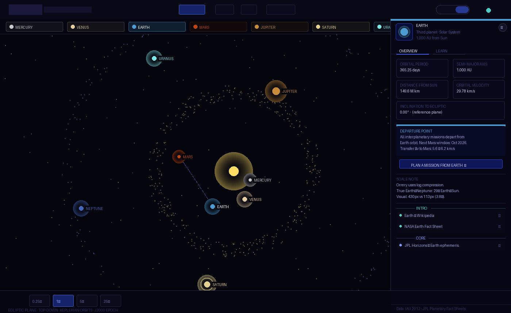
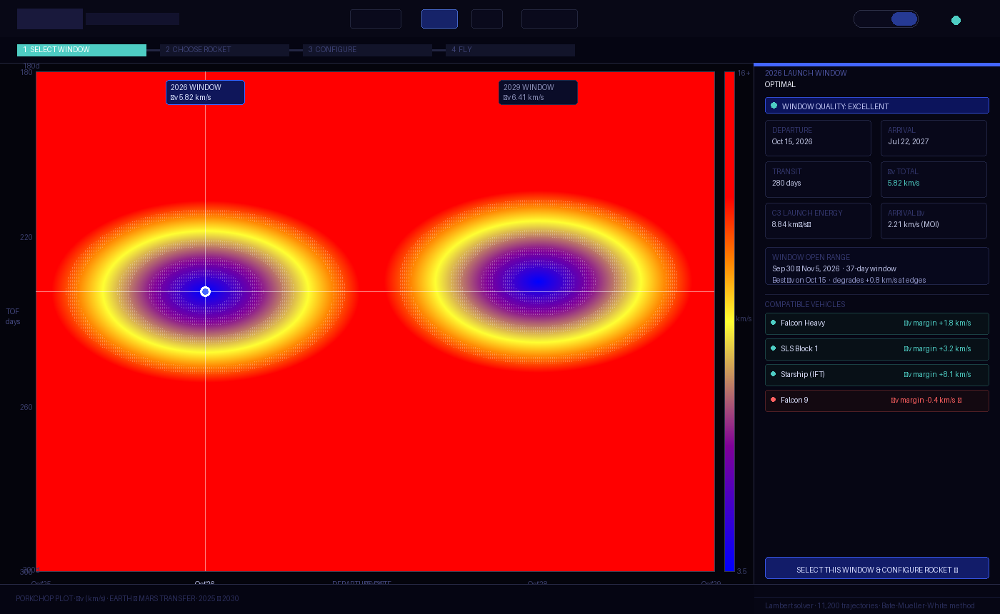
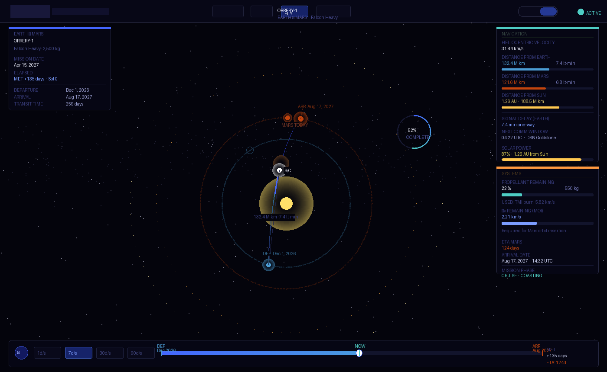
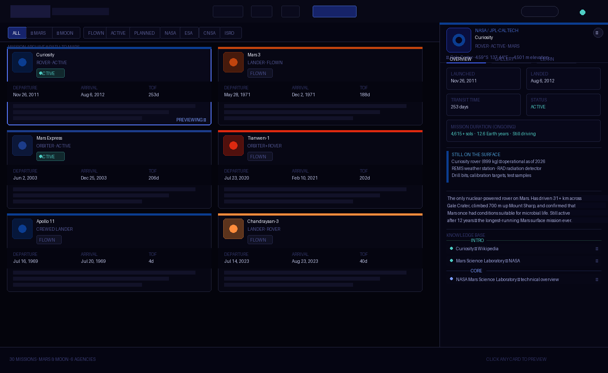
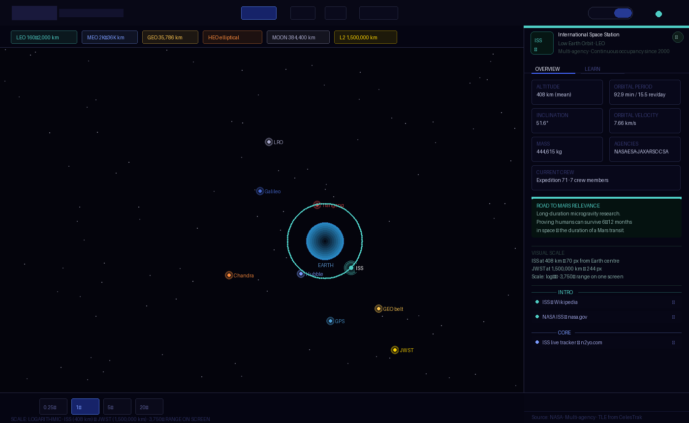
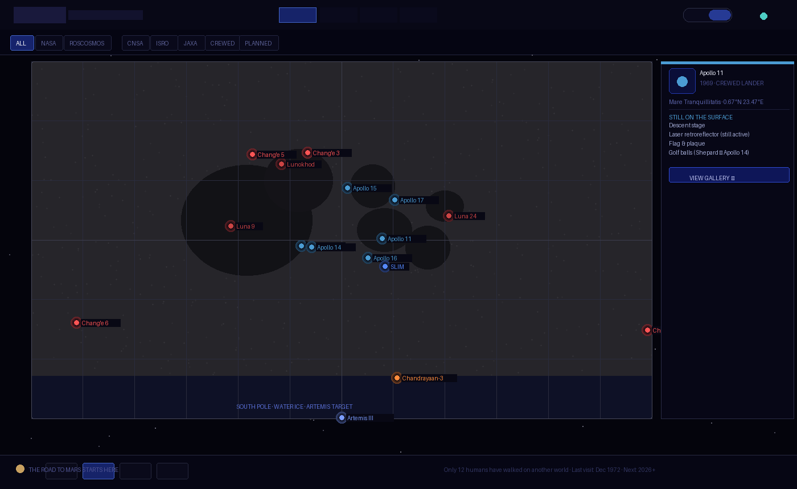

# 05 · Orrery — Design System
*April 2026 · v1.0 · Part of the Orrery Concept Package (00 through 05)*

---

## Purpose

This document captures the visual language, component patterns, and interaction conventions established through six prototype screens. It is the reference for building new screens consistently and the primary input for 04 Technical Architecture — particularly where design decisions constrain technical choices.

Every pattern here was arrived at through iteration, not specification upfront. The prototypes are the ground truth. This document distills them.

---

## 1. Brand identity

### 1.1 Name and tone

**Name:** Orrery — a mechanical model of the solar system. The name does not need explanation in context; the product explains itself.

**Editorial voice:** Direct. Precise. Occasionally poetic where the science earns it. Never dumbed down. Never inflated. The descriptions of Mars 3's 14.5 seconds of silence, of Cernan's last words, of Duke's family photo on the lunar surface — these are written in the same register as the vis-viva equation. Science and emotion at the same level.

**Tone reference:** WIRED magazine spread meets NASA trajectory diagram. Neither dominates. Both are present.

### 1.2 Design principles

1. **The beauty is the physics working.** Visual quality is not decoration — it is how the user understands what they are seeing. The luminous Keplerian arc is beautiful because it is correct.
2. **Honest about gaps.** Data quality badges, reconstruction notes, and placeholder states are first-class design elements. Never hide a gap.
3. **Maximum credit to original owners.** Every image, every logo, every number has a source. Attribution is part of the visual design.
4. **Dark, editorial, precise.** Not a consumer app. Not a game. The visual language is closer to a scientific publication than a dashboard.

---

## 2. Colour system

### 2.1 Core palette

| Token | Value | Usage |
|---|---|---|
| `bg-base` | `#04040c` | Page background. Near-black with a slight blue undertone — space, not void |
| `bg-surface` | `rgba(10, 10, 20, 0.95)` | Cards, panels |
| `bg-nav` | `rgba(4, 4, 12, 0.88–0.97)` | Navigation bar, bottom bar, filter strips |
| `bg-panel` | `rgba(4, 4, 12, 0.96–0.98)` | Detail panels, preview panels |
| `border-subtle` | `rgba(255, 255, 255, 0.07)` | Default borders |
| `border-active` | `rgba(255, 255, 255, 0.18)` | Hover state borders |
| `accent-blue` | `#4466ff` / `rgba(68, 102, 255)` | Primary interactive accent. Selection rings, active states, mission arc |
| `accent-teal` | `#4ecdc4` | Secondary accent. Active mission status, Earth orbit regime, confirmation states |
| `text-primary` | `#ffffff` | Primary text, selected labels |
| `text-secondary` | `rgba(255, 255, 255, 0.55–0.65)` | Body text, descriptions |
| `text-dim` | `rgba(255, 255, 255, 0.25–0.35)` | Labels, metadata |
| `text-faint` | `rgba(255, 255, 255, 0.12–0.18)` | Decorative text, watermarks |

### 2.2 Status colours

| Status | Colour | Background |
|---|---|---|
| ACTIVE | `#4ecdc4` | `rgba(78, 205, 196, 0.15)` |
| FLOWN | `rgba(255,255,255,0.45)` | `rgba(255,255,255,0.06)` |
| PLANNED | `#7b9cff` | `rgba(123,156,255,0.12)` |
| MINE / personal | `#4ecdc4` | `rgba(78,205,196,0.12)` |
| PRIVATE sector | `#ff9940` | `rgba(255,153,0,0.12)` |
| RECONSTRUCTED | `#ff8060` | `rgba(240,80,40,0.10)` |
| PARTIAL DATA | `#f0b428` | `rgba(240,180,40,0.10)` |

### 2.3 Educational tier colours

The three-tier educational link system uses a consistent colour language across all screens:

| Tier | Label colour | Background | Dot |
|---|---|---|---|
| INTRO | `#4ecdc4` | `#0d2e2b` | `#4ecdc4` |
| CORE | `#7b9cff` | `#0d1535` | `#4466ff` |
| DEEP | `#ff9090` | `#2e0d0d` | `#ff4444` |

### 2.4 Agency colours

Used for card accent borders (3px top), pin markers, label text, and logo backgrounds.

| Agency | Display colour | Logo background |
|---|---|---|
| NASA | `#4b9cd3` | `#0B3D91` |
| ESA | `#7b9cff` | `#1C3C8A` |
| CNSA | `#ff5555` | `#DE2910` |
| ISRO | `#ff8c3c` | `#1a1a2e` |
| Roscosmos | `#cc4444` | `#0d0d1a` |
| UAE/MBRSC | `#4ecdc4` | `#ffffff` |
| JAXA | `#5588ff` | `#0062AC` |
| SpaceX | `#ffcc66` | `#000000` |
| Personal mission | `#4ecdc4` | `rgba(78,205,196,0.08)` |
| Planned (generic) | `#7b9cff` | `rgba(68,102,255,0.15)` |

### 2.5 Orbital regime colours (Earth Orbit)

| Regime | Colour |
|---|---|
| LEO | `#4ecdc4` |
| MEO | `#7b9cff` |
| GEO | `#ffc850` |
| HEO | `#ff8c3c` |
| MOON distance | `#aaaacc` |
| L2 | `#ffd700` |

---

## 3. Typography

### 3.1 Typefaces

Three typefaces only, all loaded from Google Fonts:

```
@import url('https://fonts.googleapis.com/css2?family=Space+Mono:wght@400;700
  &family=Bebas+Neue
  &family=Crimson+Pro:ital,wght@0,400;0,600;1,400
  &display=swap');
```

| Face | Usage | Character |
|---|---|---|
| **Bebas Neue** | Hero names, screen titles, mission names | All-caps, wide letter-spacing (2–4px). The "poster" voice — bold, spatial, unapologetic |
| **Space Mono** | All UI elements — labels, data values, buttons, nav, metadata | Monospace precision. Numbers align. Technical without being cold |
| **Crimson Pro italic** | Descriptions, editorial text, facts, quotes | Humanist serif. Emotional and precise in the same stroke. The "historian" voice |

Never mix faces within a semantic role. Descriptions are always Crimson Pro italic. Data is always Space Mono. Titles are always Bebas Neue.

### 3.2 Type scale

| Role | Face | Size | Weight | Letter-spacing |
|---|---|---|---|---|
| Screen title | Bebas Neue | 20–26px | — | 3–4px |
| Mission/object name (hero) | Bebas Neue | 26–42px | — | 2–3px |
| Mission name (card) | Bebas Neue | 20–26px | — | 2px |
| Section label | Space Mono | 7px | 700 | 3px |
| Data label | Space Mono | 6–7px | 400 | 2px |
| Data value | Space Mono | 10–14px | 700 | — |
| Body label / button | Space Mono | 7–9px | 700 | 2px |
| Metadata / credit | Space Mono | 6–7px | 400 | 1px |
| Description | Crimson Pro | 11–13px | 400 italic | — |
| Fact / editorial | Crimson Pro | 12–13px | 400 italic | — |

### 3.3 Type rendering notes

- All labels use `letter-spacing` explicitly — never rely on browser defaults
- Section labels are ALL CAPS by content, not CSS `text-transform`
- Bebas Neue renders well at all sizes; use it large — 26px minimum for mission names
- Space Mono at 7px is the practical minimum for readability on dark backgrounds
- Crimson Pro italic is the emotional register — use it only for descriptions and facts, never for data

---

## 4. Spacing & layout

### 4.1 Fixed dimensions

| Element | Height |
|---|---|
| Navigation bar | 52px |
| Bottom bar | 60–68px |
| Filter strip | ~42px (varies with content) |

### 4.2 Panel widths

| Panel | Width |
|---|---|
| Mission library preview | 360px |
| Solar system detail panel | 314px |
| Mission arc HUD left | 220px |
| Mission arc HUD right | 220px |
| Moon map detail panel | 330px |
| Earth orbit detail panel | 320px |

### 4.3 Card grid

Cards use CSS Grid with `auto-fill` and `minmax(280–290px, 1fr)`. Gap is 12–14px. Cards animate in with `fadeUp` staggered by 35–40ms per card.

### 4.4 Internal spacing

| Context | Value |
|---|---|
| Card padding (sides) | 13–16px |
| Panel padding (sides) | 18–20px |
| Stats grid gap | 7–8px |
| Section label bottom margin | 4–6px |
| Icon + text gap | 5–8px |

### 4.5 Border radius

| Element | Radius |
|---|---|
| Cards | 8px |
| Panels | 0 (flush to screen edge) |
| Stats cells | 4px |
| Buttons (filter) | 3px |
| Pills (status badges) | 3px |
| Toggle pill container | 20px |
| Toggle pill buttons | 16px |
| Close button | 50% (circle) |
| Agency logo container | 6–8px |

---

## 5. Component library

### 5.1 Navigation bar

Consistent across all six screens. Height 52px. Translucent dark background with `backdrop-filter: blur(14px)`. Three zones: left (wordmark + subtitle), centre (nav links), right (view toggle + status).

```
[ORRERY  mission simulator]  [EXPLORE | PLAN | FLY | MISSIONS]  [3D | 2D]  [● LIVE]
```

Active nav item: white text, `rgba(68,102,255,0.2)` background, `rgba(68,102,255,0.45)` border.

The wordmark is always `font-family: 'Bebas Neue'; font-size: 26px; letter-spacing: 4px`. The subtitle is Space Mono 8px at 20% opacity.

### 5.2 3D / 2D view toggle

A pill-shaped container holding two buttons. The active button has a blue tint background and glow. The inactive button is transparent. Transitions on both buttons are 0.2s.

```css
container: border-radius: 20px; padding: 3px; gap: 2px;
active:    background: rgba(68,102,255,0.35); box-shadow: 0 0 12px rgba(68,102,255,0.3);
inactive:  background: transparent;
```

The toggle controls `opacity` and `pointer-events` on two sibling elements — the canvas (2D) and the renderer div (3D). Transition is 0.4–0.5s ease on opacity.

This pattern appears on P01, P03, P05, and P06. It must be identical on every screen.

### 5.3 Detail panel (right slide-in)

Used on the solar system explorer, mission arc, Earth orbit viewer, and Moon map. Slides in from the right. Pushes the grid content left in the mission library (using `margin-right`). Overlaps the 3D view on other screens.

```css
position: absolute; top: 52px; right: 0; bottom: 60–68px;
background: rgba(4,4,12,0.96-0.98);
border-left: 1px solid rgba(255,255,255,0.07);
backdrop-filter: blur(18px);
animation: slideIn / fadeIn 0.22s ease;
```

The panel always contains, top to bottom:
1. Header (object identity — name, type, agency, key stat)
2. Tab strip (OVERVIEW | GALLERY | LEARN) — where applicable
3. Stats grid (2-column)
4. Signature element (the "still on the surface" section for Moon; the "scale fact" for Earth orbit; the editorial fact for planets)
5. Description (Crimson Pro italic)
6. Educational links
7. Credit footer

The close button (×) is always top-right within the header, 24px circle, `rgba(255,255,255,0.06)` background.

### 5.4 Card (mission library)

Cards have a 3px top border in the agency colour. The rest of the border is `rgba(255,255,255,0.07)`, shifting to `rgba(255,255,255,0.18)` on hover with a -2px Y translate.

Structure:
1. 3px agency colour top border
2. Header: agency logo (52×52px) + mission name (Bebas Neue) + status pills + data quality badge + collaborator chips
3. Stats strip: 3-column grid (departure / transit / Δv or payload) — `rgba(7,7,15,1)` background
4. Description: Crimson Pro italic + "first" badge if applicable
5. Bottom prompt: "CLICK TO PREVIEW ›" — Space Mono 7px, `text-dim`

Selected card: `border-color: rgba(68,102,255,0.7)` + `box-shadow: 0 0 20px rgba(68,102,255,0.2)`.

### 5.5 Status pill

```
[● ACTIVE]  [FLOWN]  [◌ PLANNED]  [★ MINE]
```

All pills: `font-size: 7px; letter-spacing: 2px; font-weight: 700; padding: 3px 8px; border-radius: 3px`.

The ACTIVE pill includes a pulsing dot (`animation: pulse 1.5s infinite`) in the status colour.

### 5.6 Agency logo

52×52px (in cards), 36–48px (in panel headers). Always uses the "fallback always visible, real image on top" pattern:

```html
<div style="position:relative; width:52px; height:52px; border-radius:8px; background:[agency-bg]; overflow:hidden;">
  <div style="position:absolute; inset:0; display:flex; align-items:center; justify-content:center; font-family:Space Mono; font-weight:700; color:[agency-color];">ABBR</div>
  
</div>
```

The abbreviation is always visible. The real logo loads on top. Never breaks offline. In production: host logos locally from official media kits.

### 5.7 Filter buttons

```css
padding: 4-5px 11-12px;
font-size: 7px; letter-spacing: 2px; font-weight: 700;
border: 1px solid rgba(255,255,255,0.1);
border-radius: 3px;
color: rgba(255,255,255,0.35);
```

Active state: `background: rgba(68,102,255,0.25); border-color: rgba(68,102,255,0.5); color: #fff`.

### 5.8 Section label (grid divider)

```css
grid-column: 1 / -1;
font-size: 7px; letter-spacing: 3px; font-weight: 700;
color: rgba(255,255,255,0.22);
border-bottom: 1px solid rgba(255,255,255,0.05);
padding: 6px 0 4px;
```

Content examples: `YOUR MISSIONS`, `CURRENTLY ACTIVE`, `MISSION ARCHIVE — PATH TO MARS`.

### 5.9 Stats cell

```css
background: rgba(255,255,255,0.03);
border: 1px solid rgba(255,255,255,0.06);
border-radius: 4px;
padding: 8–9px 10–11px;
```

Label: Space Mono 6px, letter-spacing 2px, `rgba(255,255,255,0.25)`. Value: Space Mono 10–12px, weight 700, white.

### 5.10 Educational link row

A single link entry within a tier section:

```
[●] Link label text                                              ↗
```

The dot is 5×5px in the tier colour. The label is Space Mono 9–10px at 65–68% opacity. The arrow `↗` is Space Mono at 20% opacity. The full row has 7–8px horizontal padding, 7px vertical, 4px border radius, and transitions to `rgba(255,255,255,0.05–0.07)` on hover.

### 5.11 Gallery grid

3×3 grid of images, gap 4px. Each cell: `aspect-ratio: 1; overflow: hidden; border-radius: 3px; background: #0a0a18`. The image is `object-fit: cover; loading: lazy`. Credit footer below the grid: Space Mono 6.5–7px at 15–18% opacity.

For NASA missions: live-fetched from the NASA Images API. For others: curated Wikimedia Commons URLs. For unresolved gaps: honest placeholder text.

### 5.12 HUD (mission arc)

The mission arc fly screen uses HTML overlays over the full-screen 3D renderer, positioned absolute. Four HUD zones:

| Zone | Position | Content |
|---|---|---|
| Top-left | `top: 66px; left: 22px` | Mission identity (name, vehicle, payload) + date + elapsed time |
| Left panel | `top: 230px; left: 22px; width: 220px` | Navigation telemetry (velocity, distances, sun distance) |
| Right panel | `top: 66px; right: 22px; width: 220px` | Systems (fuel %, Δv remaining, ETA, mission phase) |
| Bottom bar | `bottom: 16px; left: 50%; transform: translateX(-50%)` | Timeline scrubber + play/pause + speed controls |

All HUD panels: `background: rgba(4,4,12,0.82); border: 1px solid rgba(255,255,255,0.07); backdrop-filter: blur(12px); border-radius: 6px`.

---

## 6. Screen patterns

### 6.1 Solar system explorer (P01)

Full-screen 3D/2D. Detail panel slides in from right (314px). Planet pills strip below nav. Bottom bar with speed controls and sim date. The 3D view is the default — the 2D top-down view is educationally valuable for showing ecliptic geometry.

**Notable:** Planet labels are HTML overlay divs, not canvas text or Three.js sprites, positioned using `position.clone().project(camera)`. This is the correct pattern for all 3D screens.



### 6.2 Mission configurator (P02)

The only screen without a 3D view — the porkchop plot is inherently 2D. The canvas is the hero. Right column shows the selected trajectory mini-diagram and mission parameters. Step indicator at top.

**Notable:** The heatmap is rendered via direct pixel manipulation (`ImageData`) for performance — 11,200 cells cannot be drawn as DOM elements.



### 6.3 Mission arc (P03)

Full-screen 3D/2D with HUD overlay. The HUD panels have `pointer-events: none` on the container with `pointer-events: auto` on individual elements — so the 3D canvas receives clicks and drags through the HUD.

**Notable:** The arrival state zooms the camera and renders a centred modal panel — the only use of a centred overlay in the product.



### 6.4 Mission library (P04)

Scrollable card grid. Preview panel is `position: fixed; right: 0` at z-index 50 — it does not affect the grid layout, but the scroll area has `margin-right: 360px` when the panel is open (JS-controlled). This gives the grid a smooth resize animation.

**Notable:** The preview panel has its own tab system (OVERVIEW | GALLERY | LEARN) independent of the main nav. Tab state is JS-managed, not URL-based.



### 6.5 Earth orbit viewer (P05)

Full-screen 3D/2D. Regime legend strip below nav. Bottom bar with speed controls. The log scale is the central design decision — the legend makes it explicit.

**Notable:** HTML label overlays for orbital objects in 3D use the same `project()` pattern as P01, but with a graceful opacity fade when objects pass behind the body. Labels disappear at `wp.z > 1`.



### 6.6 Moon map (P06)

Full-screen 3D/2D. The 3D view is a sphere — the camera orbits the Moon, not the Moon rotating. The 2D flat map uses a cylindrical projection (near side centred at 0° longitude). Filter strip replaces the planet pills. Agency filter stacks with status filter.

**Notable:** The far side missions (Chang'e 4, Chang'e 6) can only be seen in 3D by rotating the camera — this is intentional design, not a bug. The far side is literally hidden from Earth. The 2D flat map reveals it at the edges.



---

## 7. Interaction patterns

### 7.1 Camera orbit (3D views)

Consistent across P01, P03, P05, P06:

- **Mouse drag:** `camTheta += dx * 0.005–0.006; camPhi = clamp(camPhi + dy * 0.004–0.005)`
- **Scroll:** `camR = clamp(camR + deltaY * 0.5–0.7, min, max)`
- **Auto-orbit:** Slow rotation on `camTheta` (0.008–0.018 rad/s). Pauses on user interaction. Resumes after 4–5 seconds of inactivity.
- **Touch:** Same as mouse via `touches[0]`

The camera always looks at the origin (0, 0, 0). All objects are centred at the origin.

### 7.2 Hover state (3D)

Detected via `THREE.Raycaster` against invisible hit meshes (2–4× larger than visual mesh). Hit meshes are collected in an array (`pMeshes`, `pinHitMeshes`, etc.) for raycasting. Visual meshes are not raycasted directly — this is intentional for click accuracy.

On hover:
- 3D: emissive intensity increases
- 2D: cursor changes to `pointer`; object brightens
- HTML label: opacity increases to 0.9

### 7.3 Speed controls

Consistent bottom-bar pattern: `0.25× | 1× | 5× | 20–25×` buttons. Active button has blue border and teal text. Inactive has subtle border and dim text. Speed multiplier applies to `simT` advance per frame.

### 7.4 Animation conventions

| Animation | Duration | Easing |
|---|---|---|
| Panel slide-in / fade-in | 0.22s | ease |
| Card fade-up on render | 0.25s per card, staggered 35–40ms | ease |
| Status pulse dot | 1.5–2s | sine (via keyframe) |
| View toggle opacity | 0.4–0.5s | ease |
| HUD bar fill transition | 0.3s | linear |
| Label opacity | 0.15–0.2s | — |
| Arrival zoom (mission arc) | 1.2s | ease-out |

---

## 8. 3D rendering conventions

### 8.1 Three.js version

Three.js r128, loaded from Cloudflare CDN:
```
https://cdnjs.cloudflare.com/ajax/libs/three.js/r128/three.min.js
```

This version is pinned. Upgrading requires audit of all six screens — r128 has known breaking changes in later versions around `MeshStandardMaterial` and `WebGLRenderer`.

### 8.2 Renderer setup

```javascript
const renderer = new THREE.WebGLRenderer({ antialias: true, alpha: false });
renderer.setPixelRatio(Math.min(devicePixelRatio, 2)); // cap at 2× for performance
renderer.setClearColor(0x04040c, 1);
```

`alpha: false` is intentional — the background colour is always `#04040c`, never transparent.

### 8.3 Material conventions

| Use case | Material |
|---|---|
| Stars | `PointsMaterial` — size 1.2px, sizeAttenuation: false, opacity 0.65 |
| Sun | `MeshBasicMaterial` + additive glow layers |
| Planets | `MeshPhongMaterial` — shininess 20–25, emissive at 10–15% |
| Planet with texture | `MeshPhongMaterial` — map loaded via `TextureLoader`, emissive reduced to 10–15% |
| Orbit rings | `LineBasicMaterial` — opacity 0.06–0.22, depthWrite: false |
| Glow effects | `MeshBasicMaterial` — BackSide, AdditiveBlending, depthWrite: false |
| Trajectory arc | `LineBasicMaterial` — AdditiveBlending, opacity 0.45–0.55 |
| Hit meshes | `MeshBasicMaterial` — transparent: true, opacity: 0 |

### 8.4 Texture sources

| Texture | URL |
|---|---|
| Earth (atmosphere) | `https://raw.githubusercontent.com/mrdoob/three.js/master/examples/textures/planets/earth_atmos_2048.jpg` |
| Moon | `https://raw.githubusercontent.com/mrdoob/three.js/master/examples/textures/planets/moon_1024.jpg` |

All textures loaded with `TextureLoader` and error callbacks that silently fall back to procedural materials. Never blocking — the scene renders without textures while they load.

### 8.5 Label overlay pattern

HTML labels positioned over the 3D canvas using `position.clone().project(camera)`:

```javascript
const wp = mesh.position.clone().project(camera);
if (wp.z > 1) { label.style.opacity = '0'; return; } // behind camera
label.style.left = ((wp.x + 1) / 2 * innerWidth) + 'px';
label.style.top  = ((-wp.y + 1) / 2 * innerHeight) + 'px';
```

The label container is `position: absolute; inset: 0; pointer-events: none; z-index: 8` — inside the 3D renderer div, not inside the UI overlay div.

---

## 9. 2D canvas conventions

### 9.1 Canvas setup

```javascript
canvas.width = innerWidth;
canvas.height = innerHeight;
window.addEventListener('resize', () => { canvas.width = ...; canvas.height = ...; });
```

Always redraw on resize. Never scale with CSS — the canvas pixel dimensions must match the display dimensions (at 1× DPR for performance).

### 9.2 Drawing order (solar system)

1. Background fill
2. Stars (static noise)
3. Orbit rings (thin, faint)
4. Belts (asteroid, Kuiper) — particle loops
5. Comet orbit ellipses (dashed)
6. Sun glow
7. Transfer arc (if Mars selected)
8. Small bodies
9. Planets (glow, rings, dot, label)
10. Overlay text (corner labels, scale notes)

Layers matter. Objects must be drawn in depth order — small bodies before planets so planet glows render on top.

### 9.3 Coordinate system

The canvas origin `(0, 0)` is top-left. All orbital objects are drawn relative to the canvas centre `(cx, cy) = (W/2, H/2)`. The Sun is always at `(cx, cy)`.

For the Moon map 2D view, the map is centred within the canvas with padding, not full-bleed.

---

## 10. Design decisions with technical implications

These are design choices that directly constrain the technical architecture (04). Each creates a requirement.

### 10.1 Three.js CDN dependency

All six screens load Three.js from Cloudflare CDN. This means:
- **Offline use requires bundling.** The Docker Compose deployment must either bundle Three.js locally or ensure CDN access.
- **Version must be pinned.** `r128` is not the latest — the architecture must not auto-update dependencies.

### 10.2 Real-time orbital computation

The porkchop plot computes 11,200 Lambert solutions at startup. This is ~2 seconds on a modern browser. It happens once — but it happens in the main thread, which blocks rendering during that window.
- **04 implication:** The Lambert solver should be moved to a Web Worker in the production build. The prototype accepts the blocking; the product cannot.

### 10.3 External API calls (NASA Images)

The gallery tab fetches from `images-api.nasa.gov` at runtime. This means:
- **CORS must be open** from the user's browser to `images-api.nasa.gov`. It currently is (NASA allows it).
- **Offline use will fail gracefully** — the gallery shows a "requires internet access" placeholder. This is already implemented.
- **No server-side proxy required** for the NASA API — it is a public API with open CORS. ESA images are served from Wikimedia Commons URLs, which also have open CORS.

### 10.4 Font loading

Three Google Fonts families are loaded on every screen. In offline/Docker deployments, these will fail to load.
- **04 implication:** Fonts must be self-hosted in the production bundle. The system font fallbacks (`monospace`, `serif`, `sans-serif`) are acceptable degradations but will break the typographic character of the product.

### 10.5 Logo images from Wikimedia

Agency logos are hotlinked from `upload.wikimedia.org`. The fallback (abbreviation text) is always visible — the design degrades gracefully.
- **04 implication:** Production deployment should host logo files locally. The Wikimedia URLs are stable but should not be relied upon for production availability.

### 10.6 No shared state between screens

Each screen is a standalone HTML file. There is no shared state, no routing, no session management. This is appropriate for Phase 1 (prototypes) but limits the product:
- Mission planned in P02 is not automatically passed to P03
- The `/fly?id=curiosity` URL routing is defined but not implemented between files
- **04 implication:** Phase 2 requires a client-side router and shared application state. The URL routing convention (`/fly`, `/fly?id=...`, `/missions`, `/earth`) must be formalised.

### 10.7 Simulation time is local state

`simT` advances in `requestAnimationFrame` based on wall-clock time. There is no way to share or persist simulation time.
- **04 implication:** If "share my mission" is ever implemented, simulation state must be serialisable to URL parameters or a JSON file.

### 10.8 The log scale for Earth orbit is a UI decision

The `altToVis()` function in P05 uses a logarithmic formula to map altitude to pixel radius. This is a design decision that makes ISS and JWST visible on the same screen. Any change to this formula changes the visual layout of the entire screen.
- **04 implication:** The scale function must be documented as a design constant (it is in 03), not a magic number in code.

---

## 11. What to build next (design perspective)

These are features implied by the current screens but not yet designed:

1. **Mission share / export** — "Share this mission" link that encodes parameters in the URL. The mission arc needs a serialisable state format.
2. **Rocket configurator panel** — currently hardcoded in P03. The full configurator (P02 → P03 handoff) needs a designed transition.
3. **Moon mission arc** — P03 only supports Mars missions. A Moon fly screen with a 3-day Earth-Moon arc needs its own telemetry model (much shorter distances, different scale).
4. **Mobile layout** — all six screens are desktop-only. Touch interactions are partially implemented in camera orbit but the card grid, panel system, and HUD are not mobile-adapted.
5. **Accessibility** — no ARIA roles, no keyboard navigation, no reduced-motion support. Phase 2 requirement.

---

*Orrery · 05 Design System · April 2026 · Living document*
*← 04 Technical Architecture · 02 Project Concept →*
