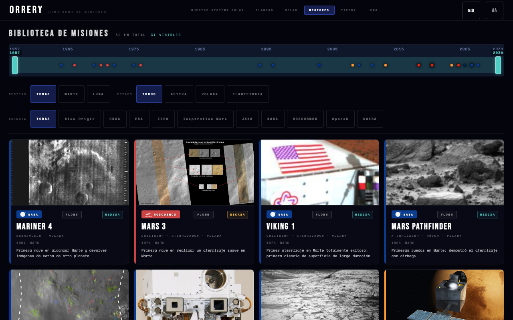

# User Guide
*Orrery — read-this-first guide for the live app · v0.3.x · May 2026*

> Every screenshot in this guide comes from the production app. Click any image to open it full-size in a new tab.

---

## Switching language

A locale picker sits in the top-right of the navigation bar. Click the chip (`EN` / `ES`) to open the dropdown, pick your language, and the URL updates to `?lang=<code>`. Bookmark the URL to lock your locale; share it and your reader gets the same.

There is no `localStorage` and no cookie — the URL is the only place your locale lives. On a fresh visit the browser language is sniffed (`navigator.language`) and applied automatically; if it doesn't match a supported locale, English is the default.

Currently shipped: **English** and **Spanish**. The roadmap (per [ADR-031](adr/ADR-031.md)): Mandarin, French, Japanese, German, Hindi, Portuguese-BR, Arabic (RTL), Korean, Russian, Italian.

---

## Solar System Explorer · `/explore`

A real-time 3D / 2D orrery showing 8 planets, 5 dwarf planets, 2 comets, and ʻOumuamua (the only confirmed interstellar object).

**What you can do**:
- **Drag** the 3D scene to orbit around the Sun.
- **Scroll** / **pinch** to zoom.
- **Click any body** — Sun, planet, dwarf, comet, ʻOumuamua — to open its detail panel with OVERVIEW · TECHNICAL · REFERENCES · GALLERY · LEARN tabs.
- **Hover** in 3D for a velocity tooltip (mean orbital velocity via vis-viva).
- **`2D` toggle** (top right) — switches to a top-down 2D plot of the ecliptic plane.
- **`REFERENCES` toggle** — opens a true-relative-size diorama of the planets.
- **`LAYERS` toggle** — show / hide PLANETS · DWARFS · COMETS · INTERSTELLAR independently. Hidden bodies aren't clickable.

---

## Mission Configurator · `/plan`

The Lambert porkchop plot. Pick a destination + mission type (LANDING or FLYBY). Each destination uses a **pre-computed** 112×100 grid (11,200 cells) checked in at `static/data/porkchop/` and loaded by the app at runtime — the Lambert **Web Worker** stays in the bundle for future custom-range work but is **not** what paints the default Mercury–Saturn maps. Cool teal cells are cheap launch windows; red cells are expensive.

**What you can do**:
- **Click any cell** to read the exact dep / arr dates, transit, and ∆v.
- **Pick a vehicle** from 13 launch rockets — the panel computes vehicle ∆v vs required ∆v and shows margin or deficit.
- **▶ FLY MISSION** — opens `/fly` with your selected dep / arr / vehicle baked into the URL.
- **Mobile**: long-press the porkchop for a magnifier loupe.

---

## Mission Arc · `/fly`

The mission visualisation. Earth, the destination, and the spacecraft animate live; the trajectory tube uses a true two-point Keplerian ellipse with Sun at focus, so both endpoints lock to live planet positions.

**What you can do**:
- **Scrub the timeline** — bottom bar — to fly the mission from launch to arrival.
- **▶ / ⏸ + speed pills** — autoplay at 1× / 7× / 30× / 90× (Mars-class missions) or 0.1× / 0.5× / 1× / 3× (lunar).
- **`2D` toggle** — switch between the 3D scene and a top-down 2D view.
- **CAPCOM panel** (right) — live mission events (TLI, TCM, EDL, etc.) tick by as you scrub.
- **Pre-built missions**: try `/fly?mission=<id>` for any of the 32 missions in the library.
- **Lunar missions** (Apollo, Artemis II, Blue Moon, Chang'e, Chandrayaan, Luna, SLIM) render heliocentrically with the Earth + Moon system orbiting the Sun, and the Moon orbiting Earth at an exaggerated visual distance so the cislunar trajectory is visible.

---

## Mission Library · `/missions`

All 32 missions in the dataset. 16 Mars + 16 Moon, spanning Mariner 4 (1964) through Starship Mars Crew (concept).

**What you can do**:
- **Filter** by destination / agency / status.
- **Timeline navigator** — scrub the year window (1957 → 2030) to narrow the set.
- **Click any card** — opens a detail panel with OVERVIEW · FLIGHT · GALLERY · LEARN tabs.
- **▶ FLY** from any panel — jumps to `/fly?mission=<id>`.

---

## Earth Orbit · `/earth`

Logarithmic radial scale showing the infrastructure that surrounds Earth: ISS, Tiangong, Hubble, JWST, Gaia, Chandra, XMM-Newton, LRO + the four GNSS constellations (GPS, Galileo, GLONASS, BeiDou) + GEO ring.

**What you can do**:
- **3D toggle** — drag to orbit Earth; objects sit at their real inclinations.
- **2D toggle** — top-down view with logarithmic radial spacing. ISS sits at one ring, GEO at another, JWST near the L2 marker.
- **Click any object** — detail panel with launch / period / inclination / crew / capability fields.
- **Year scrubber** — see what was in orbit in 1990, 2010, 2025, etc.

---

## Moon Map · `/moon`

16 lunar landing sites across 5 nations, plotted by latitude / longitude on a 3D Moon globe and a 2D equirectangular projection.

**What you can do**:
- **3D Moon** — drag to rotate, click any marker for site detail.
- **2D map** — equirectangular projection; click any marker for the same panel.
- **Site panel** — OVERVIEW · GALLERY · LEARN, plus mission-specific fields (crew, surface time, samples returned, capability unlocked).

---

## Mobile

Every screen works at 375 px width. Touch targets are 44×44 px minimum. Bottom-sheet panels swipe down to dismiss. The porkchop magnifier loupe is mobile-only (long-press on the plot).

The PWA manifest is shipped — install Orrery as a standalone app via the browser menu (Chrome / Safari / Firefox all support this; the in-app install nag is intentionally suppressed per [ADR-029](adr/ADR-029.md)).

---

## Privacy

- No analytics.
- No tracking.
- No cookies.
- No `localStorage`.
- No third-party fonts, images, or scripts loaded at runtime — every asset is bundled at build time per [ADR-016](adr/ADR-016.md).

The only state that persists across sessions is what's in the URL (`?lang=`, `?mission=`, `?dest=`, etc.) and the service-worker cache (so the app works offline after the first load).

---

## Troubleshooting

**The 3D scene is empty.** Most likely WebGL is disabled in your browser. Try a different browser or enable WebGL.

**Images don't load.** Either you're offline before the service worker has cached them, or NASA Images API is rate-limiting. Reload after a minute; cached images persist.

**A translation looks weird.** Spanish is the only non-English locale today, translated LLM-only with a physics-terminology glossary (per [ADR-033](adr/ADR-033.md)). File an issue if a term is wrong; the glossary is the binding source of truth.

**Missions render outside the camera.** For lunar missions the camera is tight on Earth + Moon (Sun off-camera by design — see [ADR-031](adr/ADR-031.md) Wave 1 scope). Drag to pan; scroll to zoom.

---

## Where to next

- **[02 Project Concept](concept/02_Project_Concept.md)** — the complete synthesis of what Orrery is.
- **[03 Data Catalog](concept/03_Data_Catalog.md)** — every constant, every source, mission schema, credit format.
- **[i18n style guide](i18n-style-guide.md)** — the binding glossary for translators.
- **`CLAUDE.md`** in the repo root — engineering constraints if you're contributing code (visible on GitHub: <https://github.com/chipi/orrery/blob/main/CLAUDE.md>).
