# User Guide

_Orrery — read-this-first guide for the live app · v0.5.x · May 2026_

> Every screenshot in this guide comes from the production app at 1280×800. Click any image to open it full-size in a new tab.

---

## Switching language

A locale picker sits in the top-right of the navigation bar. The chip shows your country flag + the locale's short tag (e.g. 🇩🇪 DE). Click it to open the dropdown, pick your language, and the URL updates to `?lang=<code>`. Bookmark the URL to lock your locale; share it and your reader gets the same.

There is no `localStorage` and no cookie — the URL is the only place your locale lives. On a fresh visit the browser language is sniffed (`navigator.language`) and applied automatically; if it doesn't match a supported locale, English is the default.

[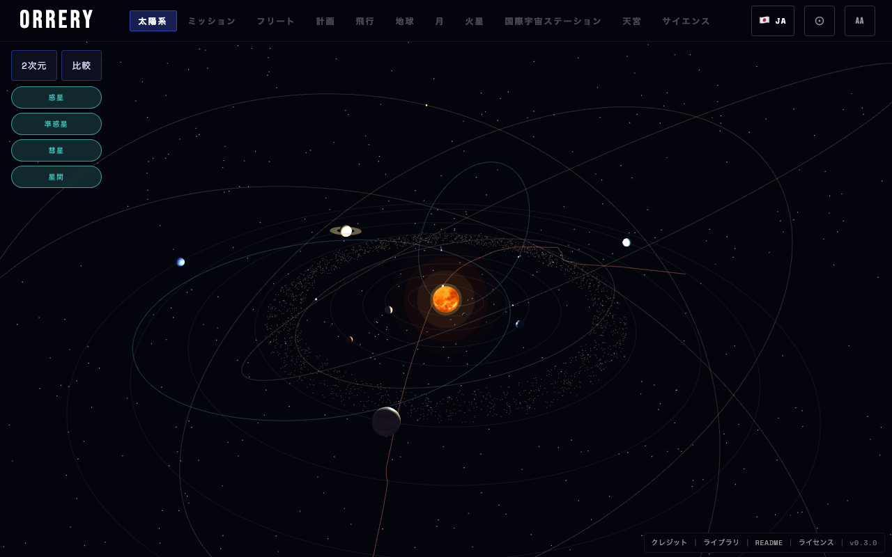](screenshots/locale-ja.png)

**Currently shipped — 13 languages, all at 100% UI parity:**

| Locale | Native name | Notes |
|---|---|---|
| `en-US` | English | Source language |
| `es` | Español | First non-English locale (v0.3.0) |
| `fr` | Français | |
| `de` | Deutsch | |
| `pt-BR` | Português (BR) | |
| `it` | Italiano | |
| `zh-CN` | 中文 (简体) | |
| `ja` | 日本語 | |
| `ko` | 한국어 | |
| `hi` | हिन्दी | Devanagari |
| `ar` | العربية | RTL — flips the entire layout |
| `ru` | Русский | Cyrillic |
| `sr-Cyrl` | Српски | Serbian Cyrillic |

The `/science` overlay tree (542 strings of editorial body text) is currently translated for **en-US, es, fr, de, it**. The remaining 8 locales fall back to en-US for the encyclopedia content while keeping their UI translations — non-blocking per [ADR-017](adr/ADR-017.md).

---

## Solar System Explorer · `/explore`

A real-time 3D / 2D orrery showing 8 planets, 5 dwarf planets, 2 comets, and ʻOumuamua (the only confirmed interstellar object).

[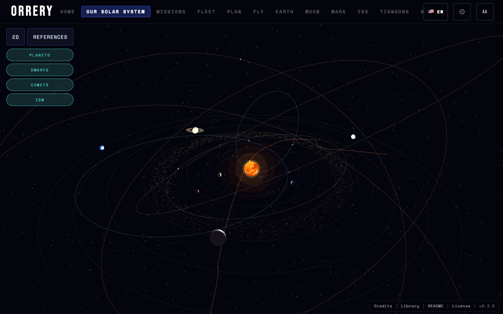](screenshots/01-explore.png)

**What you can do**:

- **Drag** the 3D scene to orbit around the Sun.
- **Scroll** / **pinch** to zoom.
- **Click any body** — Sun, planet, dwarf, comet, ʻOumuamua — to open its detail panel with **OVERVIEW · GALLERY · TECHNICAL · SCIENCE** tabs.
- **Hover** in 3D for a velocity tooltip (mean orbital velocity via vis-viva).
- **`2D` toggle** (top right) — switches to a top-down 2D plot of the ecliptic plane.
- **`REFERENCES` toggle** — opens a true-relative-size diorama of the planets.
- **`LAYERS` toggle** — show / hide PLANETS · DWARFS · COMETS · INTERSTELLAR independently. Hidden bodies aren't clickable.

**Turn on the Science Lens** (the lens icon in the nav) and the scene becomes a textbook layer:

[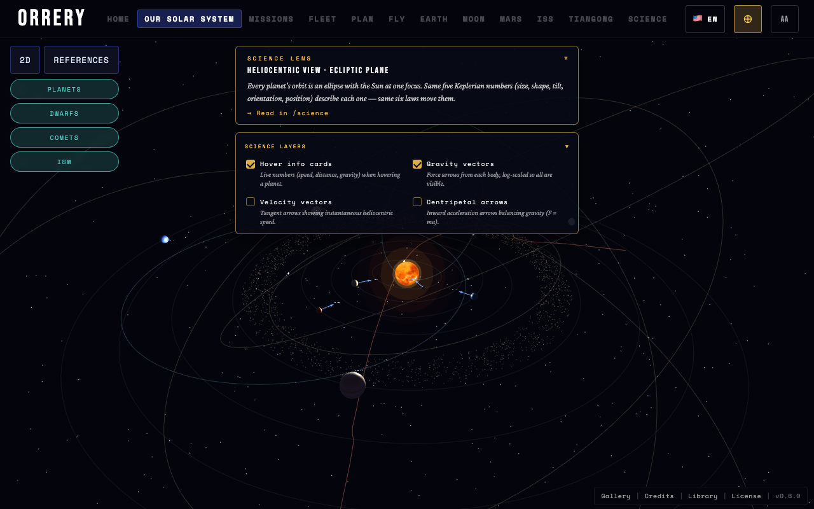](screenshots/11-science-lens-explore.png)

A **Science Lens banner** above the canvas explains the current view in plain language; a **Science Layers panel** lets you toggle individual physics layers (gravity vectors, velocity vectors, centripetal arrows, apsides + true anomaly, sphere-of-influence rings, hover info cards). Layer values print at arrow tips so you can compare magnitudes across planets.

---

## Mission Configurator · `/plan`

The Lambert porkchop plot. Pick a destination + mission type (LANDING or FLYBY). Each destination uses a **pre-computed** 112×100 grid (11,200 cells) checked in at `static/data/porkchop/` and loaded by the app at runtime — the Lambert **Web Worker** stays in the bundle for future custom-range work but is **not** what paints the default Mercury–Pluto maps. Cool teal cells are cheap launch windows; red cells are expensive.

[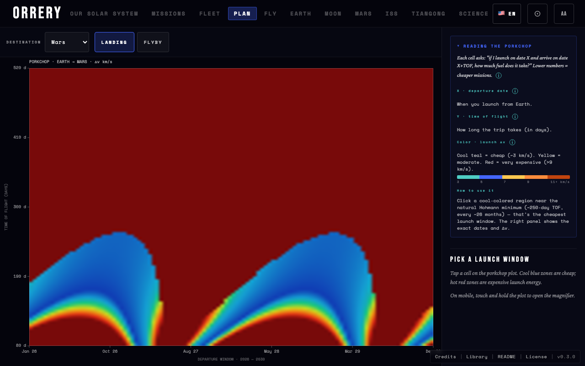](screenshots/02-plan.png)

**What you can do**:

- **Click any cell** to read the exact dep / arr dates, transit, and ∆v.
- **Pick a vehicle** from 13 launch rockets — the panel computes vehicle ∆v vs required ∆v and shows margin or deficit.
- **▶ FLY MISSION** — opens `/fly` with your selected dep / arr / vehicle baked into the URL.
- **Mobile**: long-press the porkchop for a magnifier loupe.

**Mission Sandbox** (lens on or off — always available): pin one cell with `📌 PIN THIS CELL`, then click another cell. The compare panel shows ΔDEP, ΔTOF, and Δ∆v (green chip when the new cell is cheaper, gold when more expensive). Pin clears automatically when you change destination.

[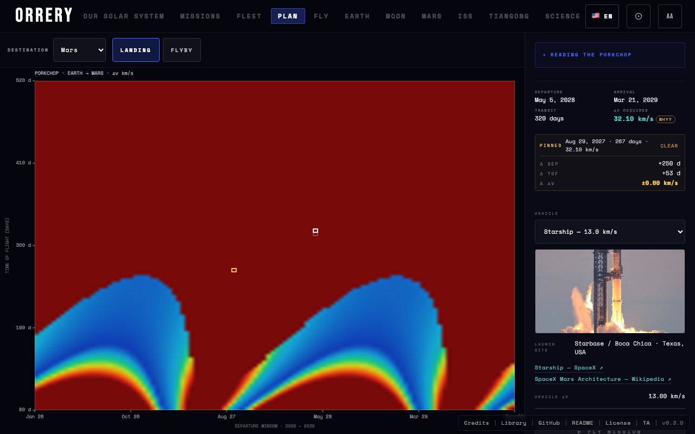](screenshots/13-mission-sandbox.png)

---

## Mission Arc · `/fly`

The mission visualisation. Earth, the destination, and the spacecraft animate live; the trajectory tube uses a true two-point Keplerian ellipse with Sun at focus, so both endpoints lock to live planet positions.

[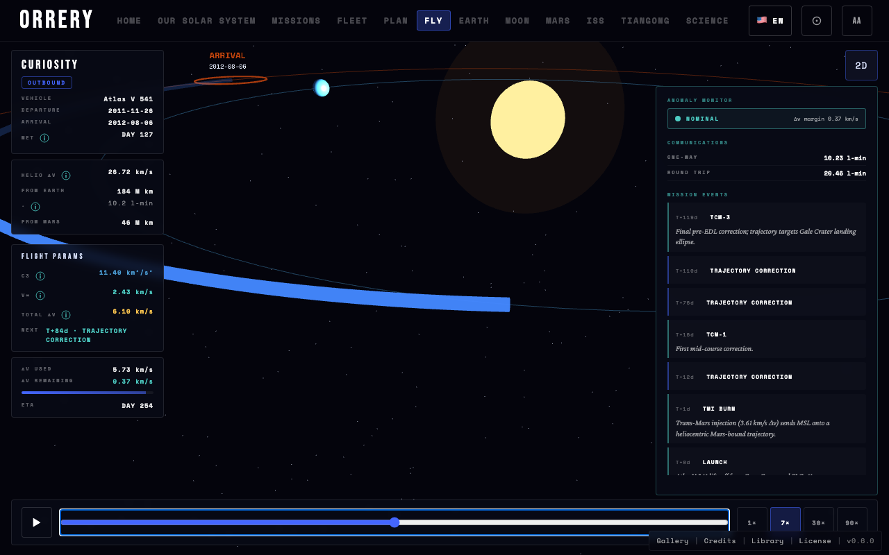](screenshots/03-fly-curiosity.png)

**What you can do**:

- **Scrub the timeline** — bottom bar — to fly the mission from launch to arrival.
- **▶ / ⏸ + speed pills** — autoplay at 1× / 7× / 30× / 90× (Mars-class missions) or 0.1× / 0.5× / 1× / 3× (lunar).
- **`2D` toggle** — switch between the 3D scene and a top-down 2D view.
- **CAPCOM panel** (right) — live mission events (TLI, TCM, EDL, etc.) tick by as you scrub.
- **Pre-built missions**: try `/fly?mission=<id>` for any of the 36 missions in the catalog.
- **Lunar missions** (Apollo, Artemis II, Blue Moon, Chang'e, Chandrayaan, Luna, SLIM) render heliocentrically with the Earth + Moon system orbiting the Sun, and the Moon orbiting Earth at an exaggerated visual distance so the cislunar trajectory is visible.

[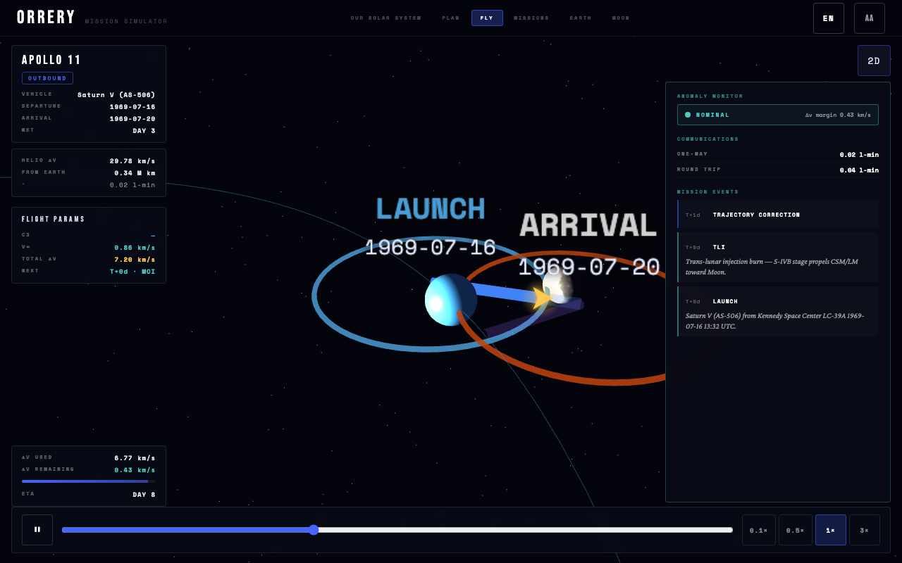](screenshots/03-fly-apollo11.png)

**Turn on the Science Lens** for the **Flight Director banner** — a 5-phase narration that flips through the mission as you scrub:

[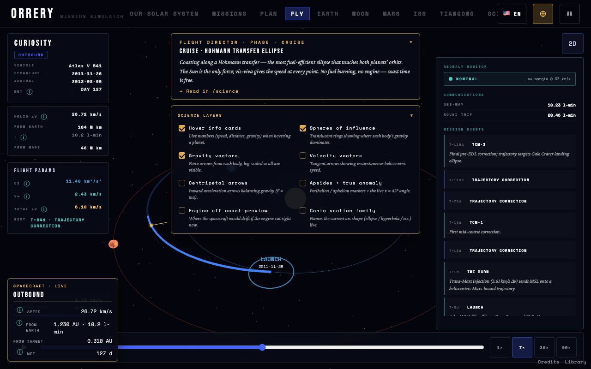](screenshots/12-flight-director.png)

| Phase | What it explains |
|---|---|
| **DEPARTURE** | C3 launch energy, leaving Earth's gravity well |
| **TRANS-X INJECTION** | The biggest single ∆v of the trip — TLI for Moon, TMI for Mars |
| **CRUISE** | The Hohmann transfer ellipse, vis-viva at every point |
| **APPROACH** | V∞ excess speed, minimum braking ∆v before insertion |
| **ARRIVAL** | Hyperbolic capture into a closed orbit |

Each phase title is a deep link into the matching `/science` chapter. The lens also unlocks a **Conic-section side panel** in the bottom-right that classifies the current arc shape (circle / ellipse / parabola / hyperbola) live from specific orbital energy.

---

## Mission Catalog · `/missions`

All 36 missions in the dataset. 16 Mars + 16 Moon + 4 outer-system entries (Galileo, Voyager 2, New Horizons, Dawn), spanning Mariner 4 (1964) through Starship Mars Crew (concept). The page was previously called "Mission Library"; it was renamed to **Mission Catalog** under [ADR-051](adr/ADR-051.md) to free the word _Library_ for the outbound-link inventory at `/library`.

[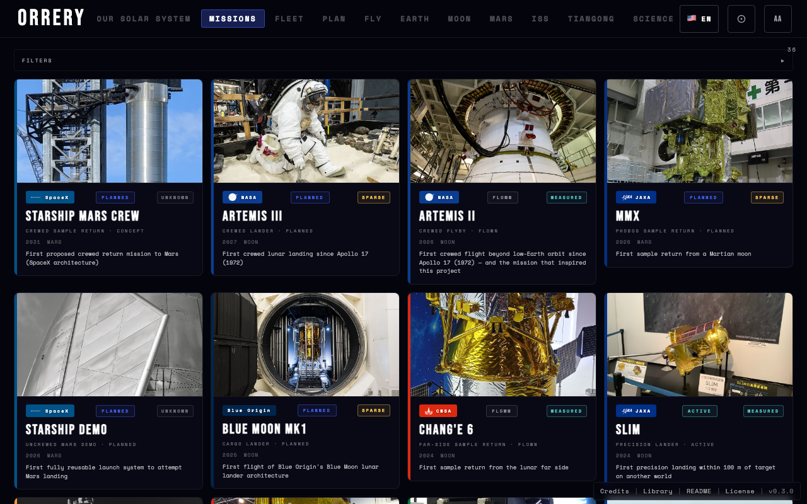](screenshots/04-missions.png)

**What you can do**:

- **`FILTERS ▸` toggle** at the top — expands the timeline navigator + filter pills (collapsed by default for a clean grid). When you land via a deep link with filter params (`?dest=MARS`, `?from=1969`, etc.) the strip auto-expands so you can see what's active.
- **Filter** by destination / agency / status.
- **Timeline navigator** — scrub the year window (1957 → 2035) to narrow the set.
- **Click any card** — opens a detail panel with OVERVIEW · FLIGHT · GALLERY · LEARN · SCIENCE tabs.
- **▶ FLY** from any panel — jumps to `/fly?mission=<id>`.
- **FLIGHT tab** carries per-mission ∆v ledgers, with caveat banners (RECONSTRUCTED / SPARSE / UNKNOWN) when the public data is incomplete.

[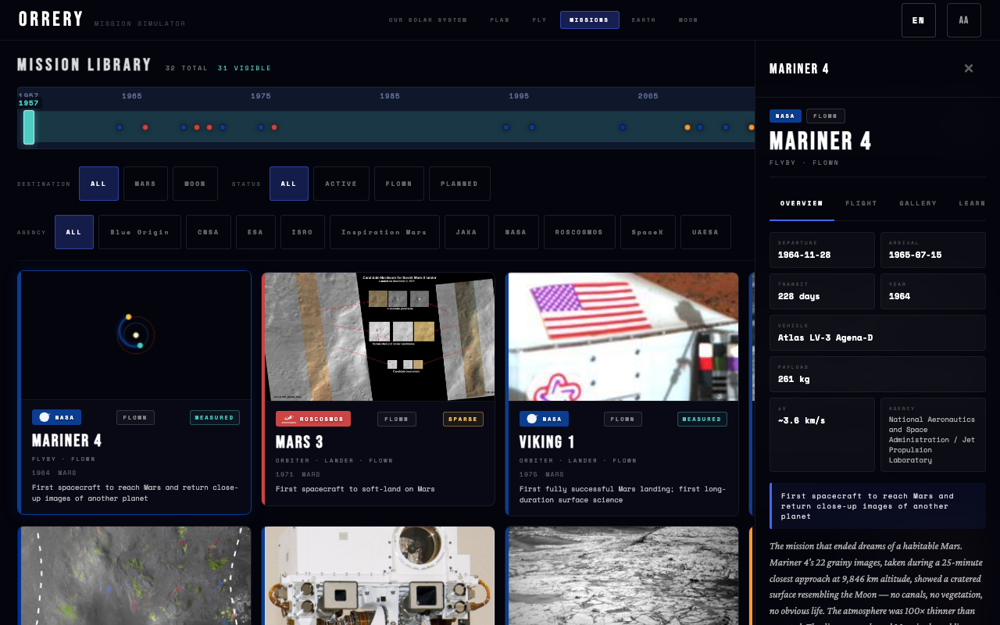](screenshots/mission-panel.png)

---

## Earth Orbit · `/earth`

Logarithmic radial scale showing the infrastructure that surrounds Earth: ISS, Tiangong, Hubble, JWST, Gaia, Chandra, XMM-Newton, LRO + the four GNSS constellations (GPS, Galileo, GLONASS, BeiDou) + GEO ring.

[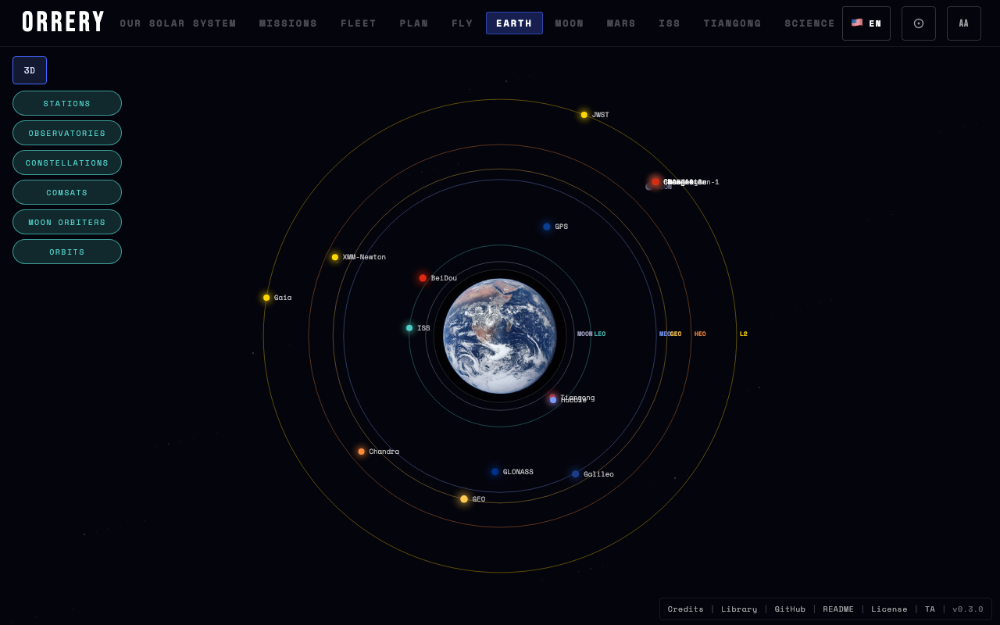](screenshots/05-earth.png)

**What you can do**:

- **3D toggle** — drag to orbit Earth; objects sit at their real inclinations.
- **2D toggle** — top-down view with logarithmic radial spacing. ISS sits at one ring, GEO at another, JWST near the L2 marker.
- **Click any object** — detail panel with launch / period / inclination / crew / capability fields, plus GALLERY · LEARN · SCIENCE tabs.
- **Layer chips** (top-left) toggle visibility for stations · observatories · constellations · comsats · Moon-orbiters · orbits.

**Lens layers**: an **atmosphere shell** at the Kármán line (100 km) and **ozone-hole indicators** over both poles (Antarctic + Arctic depletion zones) appear when the Science Lens is on.

---

## Moon Map · `/moon`

16 lunar landing sites across 5 nations, plotted by latitude / longitude on a 3D Moon globe and a 2D equirectangular projection.

[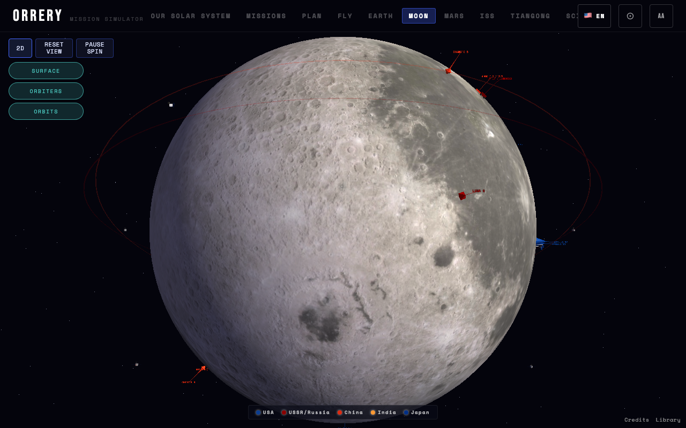](screenshots/06-moon.png)

**What you can do**:

- **3D Moon** — drag to rotate, click any marker for site detail.
- **2D map** — equirectangular projection; click any marker for the same panel.
- **Site panel** — OVERVIEW · GALLERY · LEARN · SCIENCE, plus mission-specific fields (crew, surface time, samples returned, capability unlocked).

**Lens layer**: **tidal-lock indicator** marks the Moon's near-side hemisphere (always Earth-facing — the result of synchronous rotation) when the Science Lens is on.

---

## Mars Surface Map · `/mars`

Equirectangular 2D map + 3D globe with surface-feature panels for landing sites, orbital probes, and major regions.

[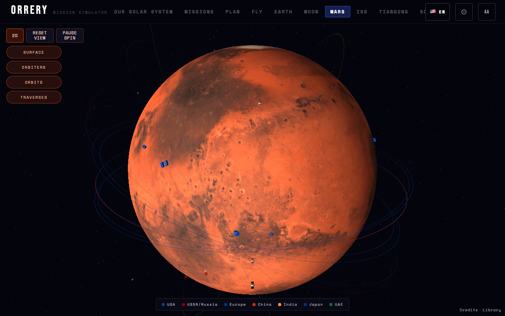](screenshots/07-mars.png)

**What you can do**:

- **3D / 2D toggle** — drag the globe in 3D or scrub a flat equirectangular projection.
- **16 surface sites** (rovers, landers, sample-return) + **11 orbital probes**, each clickable for a detail panel.
- **Rover traverse paths** overlaid as cross-linked routes on Curiosity, Perseverance, Opportunity, Spirit.
- **Layer chips** — toggle surface vs orbital separately.
- **Lens layer**: an **atmosphere shell** at ~120 km marks Mars's effective atmospheric edge.
- **Cross-links**: Curiosity / Perseverance panels deep-link to `/missions/<id>` for the full mission record.

---

## ISS Explorer · `/iss`

A full station-explorer route with raycast-pickable modules. 18 modules from every USOS + ROS module to visiting craft (Crew Dragon, Cargo Dragon, Soyuz MS, Cygnus, Progress MS, HTV-X, Starliner, Shenzhou, Tianzhou).

[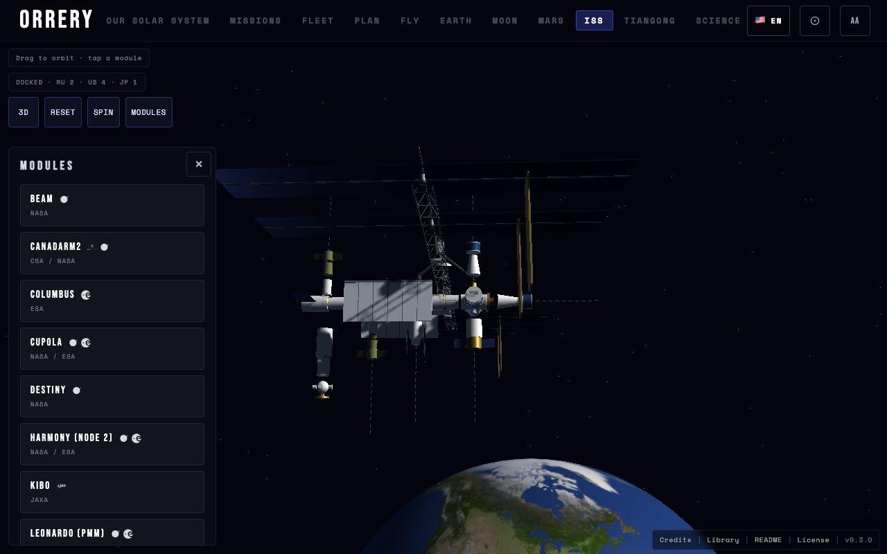](screenshots/08-iss.png)

**What you can do**:

- **Drag** to orbit the station; **scroll** to zoom; **right-drag** (or two-finger drag on touch) to pan.
- **Click any module** — opens a detail panel with **OVERVIEW · GALLERY · TECHNICAL · ANATOMY · SCIENCE · LEARN** tabs.
- **`MODULES` button** — opens a drawer listing every module with its agency badge; click any entry to fly the camera to it.
- **`PAUSE SPIN` / `RESUME SPIN`** — freeze the station's rotation for clear screenshots.
- **`RESET`** — return to the default camera position.
- **Solar arrays auto-track the Sun** with a slow continuous rotation.
- **Hover any module** to see its name in a label sprite that tracks the module's projected screen position.

**ANATOMY tab**: hand-drawn schematics for 9 visiting spacecraft (Crew Dragon, Cargo Dragon, Cygnus, Soyuz MS, Progress MS, HTV-X, Starliner, Shenzhou, Tianzhou) — each shows hatch/docking, propulsion, life-support, and trunk layouts with named callouts.

**Orbit-regime banner** at the top reads ALT · INCL · PERIOD with **Why?** popovers on each value (why ~400 km, why 51.6°, why ~92 min, why 16 sunrises a day).

**Lens layer**: turn on the Science Lens for a **microgravity axes overlay** — three colour-keyed body axes (zenith/nadir, prograde/retrograde, port/starboard) drawn at the station centre with value labels at each arrow tip.

---

## Tiangong Explorer · `/tiangong`

China's space station. Tianhe core + Wentian + Mengtian lab modules with sun-tracking gallium-arsenide arrays. Mirrors the `/iss` UX on the same shared `station-geometry` library.

[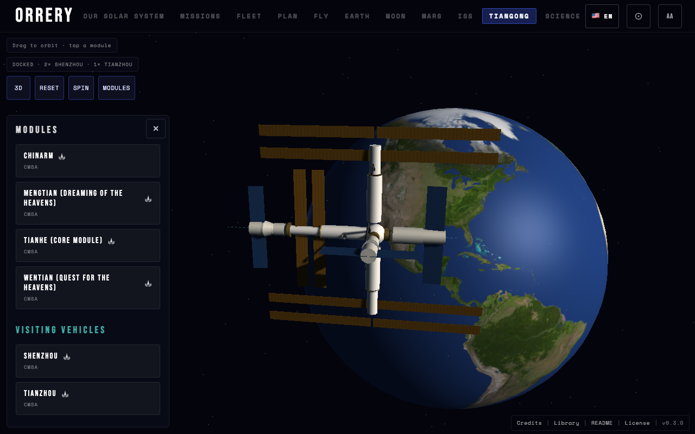](screenshots/09-tiangong.png)

**What you can do** (matches `/iss` interactions):

- **Click any module** — detail panel with same tab set as `/iss`.
- **`MODULES` drawer** with agency badges (CMSA · CASC).
- **2D blueprint views** — `2D ▾` switches between top, side, and front orthographic projections.
- **Per-module hover labels** + selected-module emissive pulse.
- **Microgravity axes overlay** lens-gated, same as `/iss`.

**Visiting craft** (Shenzhou crewed + Tianzhou cargo) render in their docked positions.

---

## Science Encyclopedia · `/science`

The in-app explainer for every concept the simulator visualises. **54 sections across 8 tabs**, plus an 8-chapter Space-101 editorial narrative on the landing page.

[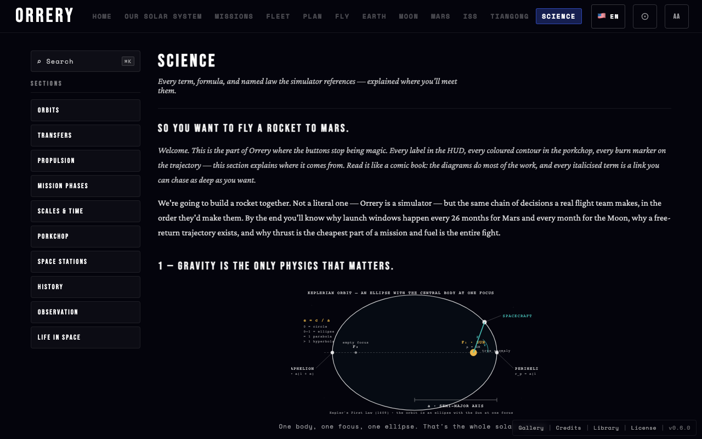](screenshots/10-science-landing.png)

**Tabs**:

| Tab | What's in it | Sections |
|---|---|---|
| **Orbits** | Kepler's laws, vis-viva, semi-major axis, eccentricity, inclination, true anomaly, apsides, orbit regimes, Keplerian orbit | 9 |
| **Transfers** | Hohmann, Lambert problem, transfer ellipse, free return, gravity assist, conic sections, patched conics | 7 |
| **Propulsion** | Tsiolkovsky equation, specific impulse, ∆v budget, C3 launch energy, V∞, Oberth effect | 6 |
| **Mission Phases** | Launch, trans-X injection, TCM, orbit insertion, EDL, EVA, MET, NRHO, mission types | 9 |
| **Scales & Time** | AU, light-minute, ecliptic plane, J2000, sidereal vs synodic, reference frames, long-duration | 7 |
| **Porkchop** | What is a porkchop, departure axis, time-of-flight axis, ∆v heatmap, contour reading, viability | 6 |
| **Space Stations** | Pressurised volume, node-module structure, solar-power budget, expedition cadence | 4 |
| **History** | Kepler 1609 · Newton 1687 · Tsiolkovsky 1903 · Goddard 1926 · Sputnik 1957 · Apollo 11 1969 | 6 |

[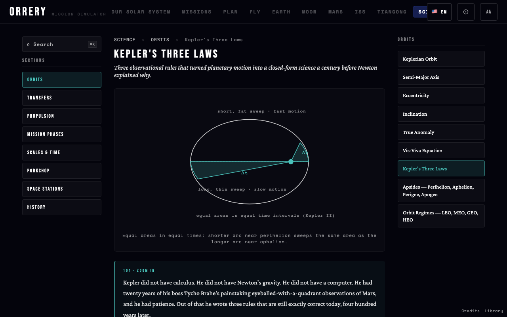](screenshots/10-science-section.png)

**What you can do**:

- **Click any tab** in the left rail (sticky on desktop; folds to a single column on mobile).
- **Right rail** lists every section in the active tab; click to navigate, current section is highlighted.
- **Cmd-K / Ctrl-K** opens a search overlay across the entire encyclopedia — type a few letters of any concept (vis-viva, Hohmann, Kármán, etc.) and Enter navigates straight to the section.
- **Cross-screen `?` chips** — every numeric label across `/missions`, `/fly`, `/explore`, `/plan`, `/earth`, `/moon`, `/mars`, `/iss`, `/tiangong` carries a `?` chip that deep-links to the matching encyclopedia section.
- **Why? popovers** on individual values inline-explain the meaning without a route change.

**Math**: KaTeX server-rendered at build time per [ADR-034](adr/ADR-034.md) — the client receives static HTML, no JavaScript math library is shipped. **Diagrams**: 62 hand-coded SVGs (54 per-section + 8 tab covers; engineering blueprint style — white-on-black with teal accents) per [ADR-035](adr/ADR-035.md).

---

## Provenance pages

### `/credits` — every image, text source, and logo

Public attribution page generated from `static/data/image-provenance.json` (auto-built by `scripts/build-image-provenance.ts`), `static/data/text-sources.json`, and `static/data/source-logos.json`. Every image in the app appears here with its license, source, and the original URL.

[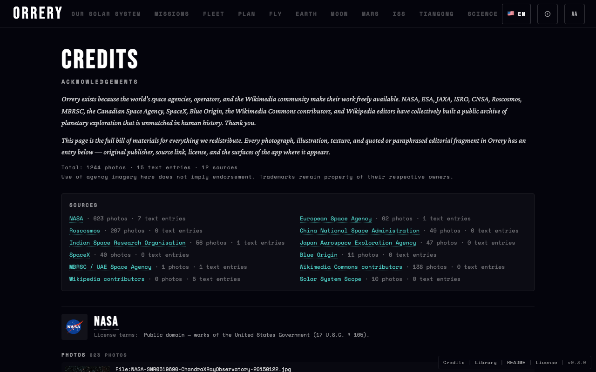](screenshots/14-credits.png)

Image sourcing is **agency-first** per [ADR-046](adr/ADR-046.md): NASA / ESA / ISRO / CNSA / JAXA / KARI / Roscosmos before Wikimedia Commons fallback. Per-image provenance is AJV-validated and **fail-closed** in `validate-data` (per [ADR-047](adr/ADR-047.md)) — adding an image without a provenance row breaks CI.

### `/library` — every outbound LEARN link

Bill-of-links across the entire app. Each external link the app exposes (in panel LEARN tabs, `/science` references, `/credits` source URLs) appears here with its provenance row: source agency, language, freshness check date, status.

[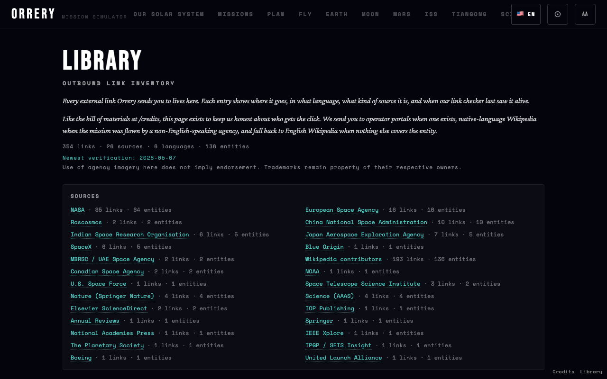](screenshots/15-library.png)

Link policy is **agency-first, native-language priority** per [ADR-051](adr/ADR-051.md): for non-US entities, the operator's own page (in their own language) wins over the NASA mirror. Roscosmos before Wikipedia. ISRO before press releases. The link-checker (`scripts/check-learn-links.ts`) is chained into `npm run fetch` so dead links are flagged before they ship.

---

## Mobile

Every screen works at 375 px width. Touch targets are 44×44 px minimum. Bottom-sheet panels swipe down to dismiss. The porkchop magnifier loupe is mobile-only (long-press on the plot).

The PWA manifest is shipped — install Orrery as a standalone app via the browser menu (Chrome / Safari / Firefox all support this; the in-app install nag is intentionally suppressed per [ADR-029](adr/ADR-029.md)).

---

## Privacy

- No analytics.
- No tracking.
- No cookies.
- No `localStorage`.
- No third-party fonts, images, or scripts loaded at runtime — every asset is bundled at build time per [ADR-016](adr/ADR-016.md).

The only state that persists across sessions is what's in the URL (`?lang=`, `?mission=`, `?dest=`, etc.) and the service-worker cache (so the app works offline after the first load).

---

## Troubleshooting

**The 3D scene is empty.** Most likely WebGL is disabled in your browser. Try a different browser or enable WebGL.

**The 3D scene drops to a list view.** `/iss` and `/tiangong` auto-fall back to a module list when measured FPS drops below 20 (typically on integrated GPUs running with software rasterisation). Reload — sometimes the first paint is slower than later runs.

**Images don't load.** Either you're offline before the service worker has cached them, or the agency image API is rate-limiting. Reload after a minute; cached images persist.

**A translation looks weird.** All 13 locales now ship at 100% UI parity, but the `/science` encyclopedia body text is currently translated for en-US/es/fr/de/it; the other 8 locales fall back to English for that surface. File an issue if a UI string looks wrong; the [i18n style guide](i18n-style-guide.md) is the binding source of truth per [ADR-033](adr/ADR-033.md).

**Missions render outside the camera.** For lunar missions the camera is tight on Earth + Moon (Sun off-camera by design — see [ADR-031](adr/ADR-031.md) Wave 1 scope). Drag to pan; scroll to zoom.

**A linked external page is dead.** File an issue or PR — the provenance manifest at `static/data/link-provenance.json` is the source of truth and welcomes corrections. Run `npm run check-learn-links -- --update` to regenerate the freshness gates.

---

## Where to next

- **[02 Project Concept](concept/02_Project_Concept.md)** — the complete synthesis of what Orrery is.
- **[03 Data Catalog](concept/03_Data_Catalog.md)** — every constant, every source, mission schema, credit format.
- **[i18n style guide](i18n-style-guide.md)** — the binding glossary for translators.
- **`CLAUDE.md`** in the repo root — engineering constraints if you're contributing code (visible on GitHub: <https://github.com/chipi/orrery/blob/main/CLAUDE.md>).
- **In-app**: open the `/science` encyclopedia and read the **Space-101** narrative on the landing page — an 8-chapter primer that takes you from "what is an orbit" to "how a Hohmann transfer works" with no jargon.
